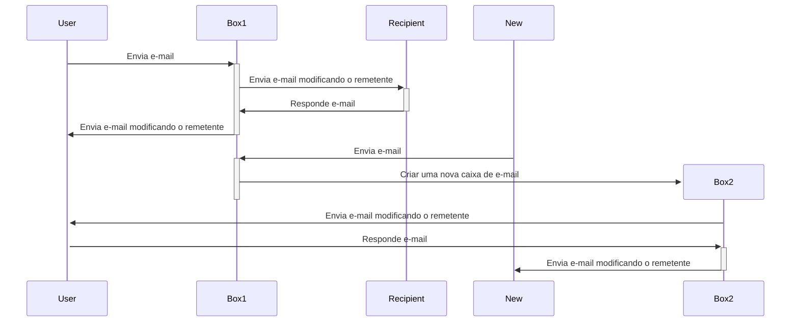
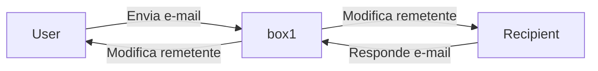
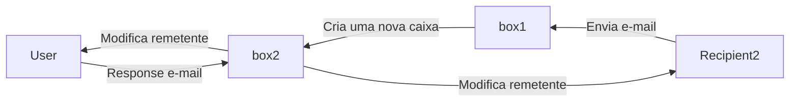

# e-Box - Broker de e-mails
- Atua como uma caixa postal de correio


- Como funciona




### Configurações de deploy

- Install Submodules

```shell
git submodule init
git submodule update --recursive --remote
# git submodule add https://github.com/frkr/util-js.git
```

- Queue

```shell
npx wrangler queues create ebox
wrangler r2 bucket create ebox
```

#### Banco
```shell
## East North America
npx wrangler d1 create ebox --location=enam
```
```shell
npx wrangler d1 execute ebox --local --file=./schema.sql

npx wrangler d1 execute ebox --local --command="SELECT * FROM boxes"
```
```shell
npx wrangler d1 execute ebox  --file=./schema.sql

npx wrangler d1 execute ebox  --command="SELECT * FROM boxes"
```

# DKIM
```shell
openssl genrsa 2048 | tee priv_key.pem | openssl rsa -outform der | openssl base64 -A | wrangler secret put DKIM_PRIVATE_KEY
echo -n "v=DKIM1;p=" > record.txt && openssl rsa -in priv_key.pem -pubout -outform der | openssl base64 -A >> record.txt
```

## DNS
- TXT

```text
mailchannels._domainkey
```
```text
(record.txt)
```

- TXT

```text
_mailchannels
```

```text
v=mc1 cfid=mundial.workers.dev
```

# Links
- https://blog.mailchannels.com/mailchannels-enables-free-email-sending-for-cloudflare-workers-customers/
- https://github.com/maggie-j-liu/mail
-
